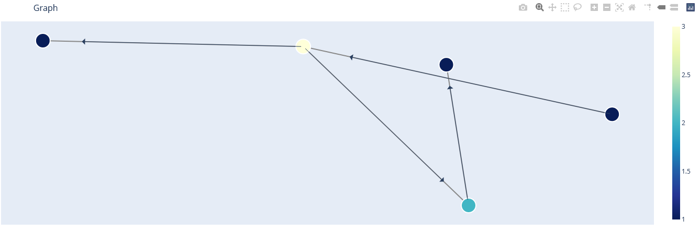

# Interactive Graph Visualization
   [](https://igviz.readthedocs.io/en/latest/?badge=latest)

<!-- START doctoc generated TOC please keep comment here to allow auto update -->
<!-- DON'T EDIT THIS SECTION, INSTEAD RE-RUN doctoc TO UPDATE -->
## Table of Contents

- [Introduction](#introduction)
- [Usage](#usage)
- [Installation](#installation)
- [Feedback](#feedback)
- [Contributors](#contributors)

<!-- END doctoc generated TOC please keep comment here to allow auto update -->

## Introduction

Interactive Graph Visualization (igviz) is a library to help visualize graphs interactively using Plotly. This library provides a customizable api for visualizing graphs in a neat, visually appealing plot. It keeps larger graphs much more clean by displaying minimal text information and highlights node properties and relationships using colour and size while providing the same text information when needed.


## Usage

Example notebooks can be found [here](https://github.com/Ashton-Sidhu/plotly-graph/tree/master/examples).

### Basic

```python
import networkx as nx
import igviz as ig

G = nx.random_geometric_graph(200, 0.125)
nx.set_node_attributes(G, 3, "prop")

ig.plot(G)
```

The default plot colors and sizes the nodes by the Degree but it is configurable.


### Configurations

```python
ig.plot(
    G, # Your graph
    title="My Graph",
    size_method="static", # Makes node sizes the same
    color_method="##ffcccb", # Makes all the node colours black,
    node_text=["prop"], # Adds the 'prop' property to the hover text of the node
    annotation_text="Visualization made by <a href='https://github.com/Ashton-Sidhu/plotly-graph'>igviz</a> & plotly.", # Adds a text annotation to the graph
)
```


```python
ig.plot(
    G,
    title="My Graph",
    size_method="prop", # Makes node sizes the size of the "prop" property
    color_method="prop", # Colors the nodes based off the "prop" property and a color scale,
    node_text=["prop"], # Adds the 'prop' property to the hover text of the node
)
```


#### How to add your own custom sizing method and colour method

To add your own custom sizing and color method, just pass a list to the `size_method` and `color_method`.

```python
color_list = []
sizing_list = []

for node in G.nodes():
    size_and_color = G.degree(node) * 3

    color_list.append(size_and_color)
    sizing_list.append(size_and_color)

ig.plot(
    G,
    title="My Graph",
    size_method=sizing_list, # Makes node sizes the size of the "prop" property
    color_method=color_list, # Colors the nodes based off the "prop" property and a color scale,
    node_text=["prop"], # Adds the 'prop' property to the hover text of the node
)
```


#### Applying layouts

All layouts are calculated through the `pos` property on each node. Networkx has built in layouts you can use and can invoke through igviz.

```python
ig.plot(
    G,
    title="My Graph",
    layout="kamada",
)
```


To add your own `pos` property you can set it via the `nx.set_node_attributes` function.

```python
pos_dict = {
    0: [1, 2], # X, Y coordinates for Node 0
    1: [1.5, 3], # X, Y coordinates for Node 1
    ...
}

nx.set_node_attributes(G, pos_dict, "pos")

ig.plot(
    G
)
```

#### Directed & Multi Graphs

Igviz also plots Directed and Multigraphs with no configuration chages. For Directed Graphs the arrows are shown from node to node. For Multi Graphs only one edge is shown and it is recommended to set `show_edgetext=True` to display the weights of all edges between 2 Multi Graph nodes.

Note: `show_edgetext=True` also works for vanilla and Directed Graphs.

##### Directed Graph

```python
def createDiGraph():
    # Create a directed graph (digraph) object; i.e., a graph in which the edges
    # have a direction associated with them.
    G = nx.DiGraph()

    # Add nodes:
    nodes = ['A', 'B', 'C', 'D', 'E']
    G.add_nodes_from(nodes)

    # Add edges or links between the nodes:
    edges = [('A','B'), ('B','C'), ('B', 'D'), ('D', 'E')]
    G.add_edges_from(edges)
    return G

DG = createDiGraph()

ig.plot(DG, size_method="static")
```


##### Multi Graph

```python
MG = nx.MultiGraph()
MG.add_weighted_edges_from([(1, 2, 0.5), (1, 2, 0.75), (2, 3, 0.5)])

ig.plot(
    MG,
    layout="spring",
    size_method="static",
    show_edgetext=True,
    colorscale="Rainbow"
)
```


## Installation

`pip install igviz`

## Feedback

I appreciate any feedback so if you have any feature requests or issues make an issue with the appropriate tag or futhermore, send me an email at ashton.sidhu1994@gmail.com

## Contributors

This project follows the [all-contributors](https://github.com/kentcdodds/all-contributors) specification and is brought to you by these [awesome contributors](./CONTRIBUTORS.md).
